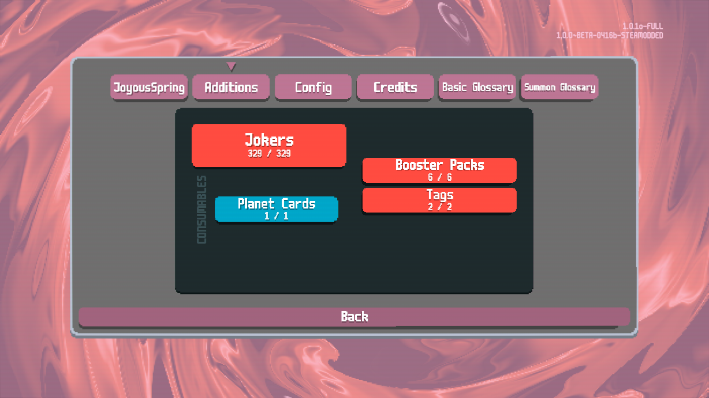

# JoyousSpring - Balatro Mod

(French Translation of the mod) 

ONLY ADDED "fr.lua" in the localization folder and translated the readme, didn't change anything else

Ajoute des cartes et mécaniques modernes de Yu-Gi-Oh!

## Installation

1. Installez [Steamodded](https://github.com/Steamopollys/Steamodded) [(version >1.0.0)](https://github.com/Steamodded/smods/wiki)
2. Téléchargez la [dernière version](https://github.com/nh6574/JoyousSpring/releases)
3. Dézippez le dossier (et pas les fichiers) pour l'inclure dans le dossier mods de Balatro (%appdata%\Balatro\Mods)

Regardez bien le Glossaire et les Configs dans le Menu > Mods > JoyousSpring

Est compatible avec [JokerDisplay](https://github.com/nh6574/JokerDisplay) version >1.8.2

Hésitez pas à rejoindre le discord (lien de nh6574) [Discord](https://discord.gg/Ac5FKpQCRV) en cas de problèmes ou pour discuter du mod <3

## Problèmes connus

- Ce mod est toujours une ébauche 
- Les Matériels et Extra Deck ne fonctionnent pas correctement avec une manette
- N'a pas été testé avec d'autres mods que JokerDisplay
- 
## Screenshots

## Contenu du mod

|||||||
|--|--|--|--|--|--|
| [Dragonirène](https://balatromods.miraheze.org/wiki/JoyousSpring/Jokers/Dragonmaid)| [Live☆Jumelles](https://balatromods.miraheze.org/wiki/JoyousSpring/Jokers/LiveTwin)| [Dogmatika](https://balatromods.miraheze.org/wiki/JoyousSpring/Jokers/Dogmatika)| [Filles Fantômes](https://balatromods.miraheze.org/wiki/JoyousSpring/Jokers/Ghost_Girls)| [Spright](https://balatromods.miraheze.org/wiki/JoyousSpring/Jokers/Spright)| [Mekk-Chevalier](https://balatromods.miraheze.org/wiki/JoyousSpring/Jokers/Mekk-Knight)|
| [Genèraideur](https://balatromods.miraheze.org/wiki/JoyousSpring/Jokers/Generaider)| [Ghoti](https://balatromods.miraheze.org/wiki/JoyousSpring/Jokers/Ghoti)| [Structure-PSY](https://balatromods.miraheze.org/wiki/JoyousSpring/Jokers/PSY-Frame)| [Runick](https://balatromods.miraheze.org/wiki/JoyousSpring/Jokers/Runick)| [Abysses Ardents](https://balatromods.miraheze.org/wiki/JoyousSpring/Jokers/Burning_Abyss)| [Labrynth](https://balatromods.miraheze.org/wiki/JoyousSpring/Jokers/Labrynth)|
| [Subterreur](https://balatromods.miraheze.org/wiki/JoyousSpring/Jokers/Subterror)| [Surnaliche](https://balatromods.miraheze.org/wiki/JoyousSpring/Jokers/Eldlich)| [@Ignister](https://balatromods.miraheze.org/wiki/JoyousSpring/Jokers/@Ignister)| [Solfaccord](https://balatromods.miraheze.org/wiki/JoyousSpring/Jokers/Solfachord)| [Artisanesorcière](https://balatromods.miraheze.org/wiki/JoyousSpring/Jokers/Witchcrafter)| [Marionnette de l'Ombre](https://balatromods.miraheze.org/wiki/JoyousSpring/Jokers/Shaddoll)|
| [Paléozoïque](https://balatromods.miraheze.org/wiki/JoyousSpring/Jokers/Paleozoic)| [Invokhé](https://balatromods.miraheze.org/wiki/JoyousSpring/Jokers/Invoked)| [Danger!](https://balatromods.miraheze.org/wiki/JoyousSpring/Jokers/Danger!)||| [Agents Libres](https://balatromods.miraheze.org/wiki/JoyousSpring/Jokers/Free_Agents)|

## Contributing

I might drop this at any moment (if I haven't already), so please feel free to fork or do PRs if you feel like you can improve on this or fix any of the problems above!

I will be strict with any card constributions that don't fit the theme of the mod. Also, when contributing an archetype I'm not merging PRs until a minimum viable version of the entire archetype is finished.

## Contact

If you have any issues feel free to contact me on [Bluesky](https://bsky.app/profile/nh6574.com) or [on the official Balatro Discord as nh6574](https://discord.com/invite/balatro)

And here's my [ko-fi link](https://ko-fi.com/nh6574) if you feel especially grateful.

Also check out my Quality of Life mod [JokerDisplay](https://github.com/nh6574/JokerDisplay)!
